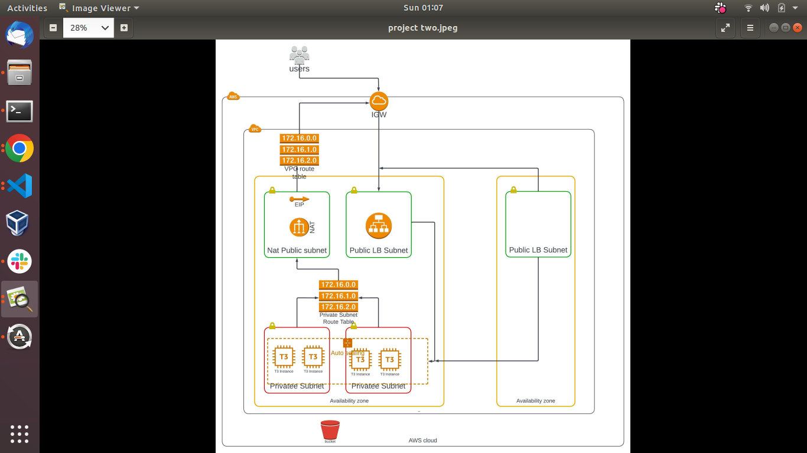

I am very excited to be your host and at the same time your tour guide. You are welcome to the VPC hotel here at AWS. In view is a map to visually aid our imagination and guide us during the course of this trip.

Let me start by showing you how to find your way around in case of any unforeseen incidence. First and foremost, we have two sections here at this VPC and we refer to them as **AZ**. On your way here you passed the very secure gate, Aws staffs calls it **IGW**, but I prefer the full name ***internet Gateway***. The strength of the **IGW** is what we bank on and it's the only way in or out of this VPC. Only authorized users can access it and you can see it's location on the map.

Moving on, is the receptionist office, there will see a nice lady who's an expert in multitasking and she also makes sure no department is over worked. No AWS staff knows her by her real name so we call her by her nature, **Load Balancer** or LB for short. She has two offices in this branch, one of them is where we'll be visiting next and the other one she only uses when something goes wrong is this AZ. She swiftly changes her office to get all staffs back on track and controls the chaos. Much Later, I will share more details on her role and why we appreciate her job. You can see her offices on the map too.

I forgot to mention we refer to rooms or offices as **SubNet**. We go the length to localize the experience. So public offices that have less restriction are called **Public Subnets** and restricted ones are called? You guessed it, **Private Subnet**!

When LB clears us, we should have a **Subnet** and a luggage boy to take us there. I must warn you about luggage boys, they have very strict policies to follow instructions given to them by LB in one heavily protected note. They'll raise the note and yell **Route Rule**! **Route Rule**! Whenever you try to tip them to change course. Even I can't make them change their course. Dumb and loyal and I just called them **Route**! They will take us to our allocated **Private Subnet** without fail.

Hopefully, you will like your **subnet**, But if you don't, you have the privilege to do as you please. The room comes with a basic plan and it's completely free for a year, but you can satisfy your curiosity and possibly customize your **subnet**. Please check the **instances list** to see your options. Myself and staffs calls the options **EC2**, which is **Elastic compute cloud** in full. You have flavor of Windows, Linux and even the latest Mac2...

I must spill! Scott Malkie, Farrah Campbell and Steve showcased its features just last week. So if you are going to do some heavy lifting, this **VPC** have you covered. Whatever option you eventually go with, it only takes some few minutes to set up by our **Launch Configuration** department. 

When you are settled in your customize Ec2 instance and you feel like stepping out, you can call the **Route** boy. They would take you through a different hallway, much different from the one you took to your **Private subnet**. This **VPC** Have a special requirement for those lodging in **Private subnet**. You are our top priority customer and is a must, you drop your **EIP** keys with Mr **NAT** before leaving your **Private Subnet**. 

Mr **NAT**'s office, Sorry, I meant **"subnet"** is also on the map. NAT is just and acronym of his name **Network address translator**. If it wasn't for unfair company's politics, I should be in charge of his **subnet**. Please be careful with him, it's one way with him. 

So, back to Lb, Who is my favorite person in this hotel, actually she is everyone's favorite. For each customizable subnet you decide to go with, she keeps an exact replica in the other AZ where her second office is located. So maybe your room gets flooded or have a power failure. Although, these sorts of things rarely happens, she works with **launch Configuration** and **Auto Scaling** department to make sure you have a spare room and a very smooth transition to the other AZ. Enough about LB before you start questioning my emphasis.

Before I let you go, There is a tiny note that would be given to you, it's called **Route Table**. It contains all the places you can possibly visit within this **AZ**. You can call the **Route boy** to take you to anyone... You are allowed to add more exciting places. Feel free to call the **Security Groups** department to help you with that. 

**Here are keynote you should remember**

- Mrs LB two offices, in case of any incident
- Don't tip the Route boys. Route boys, the Security Group and the Route Rules work in a mix to keep us secured within this VPC.
- Offices are public subnet, rooms are private subnet and section are AZ (Availability Zone)
- EIP is your key to leave your subnet 
- You use Mr NAT Public Subnet before leaving and remember to drop your keys

## Hope you have a nice time here at AWS VPC.