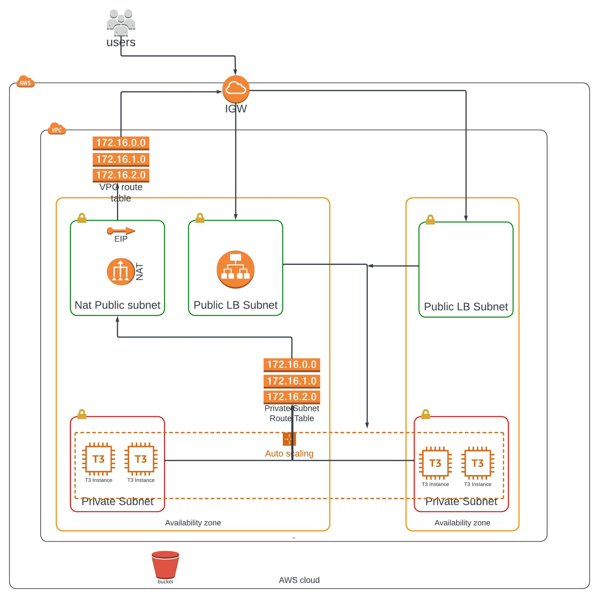

# 👷🔧🔩 Infrastructure as code 

> ## 👀 with Cloud formation 

### considerations
- The site is mainly for developers to test and curate measurable matrix 
- It has to be cost effective 
- Closely similar to production environment 
- Ease to setup or dispose 
- the set up need should have 2 vCPUs and at least 4GB of RAM. The Operating System to be used is Ubuntu 18.

## Implementation

The repo has two major files. One for the [network](project_starter/server_network.yml) and the other for the [servers](project_starter/server.yml) 

The network file has the following components 
- VPC
- Internet Gateway
- 2  availability zones
- 3 public subnet 
  - One public subnet houses the a NAT and the remaining holds the a load balancer across the availability zones
- 2 private subnet 
  - This private subnet houses the servers and spread across 2 Availability zone (AZ)
  
There are shell scripts to make work easier. Run the Network file and the json file containing variables like CIDR, like so...

create `./create.sh  server_network.yml server_network_params.json`

update `./update.sh  server_network.yml server_network_params.json`

the server has the following components 
- Elastic load balancer
- Target group
- ListenerRule
- Listener
-  2 SecurityGroups
-  AutoScalingGroup
- LaunchConfiguration
  
the shall script can be used 

create `./create.sh  server.yml server.json`

update `./update.sh  server.yml server.json`

Also, I made an analogy of the traffic in this VPC with and hotel, please [read](https://dev.to/ekamanelly/welcome-to-hotel-vpc-at-aws-14d8)